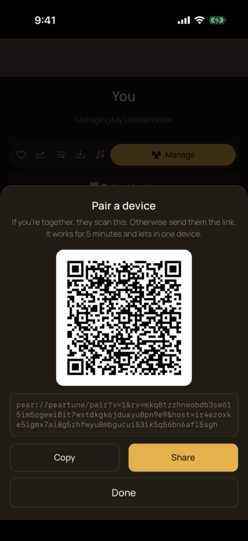
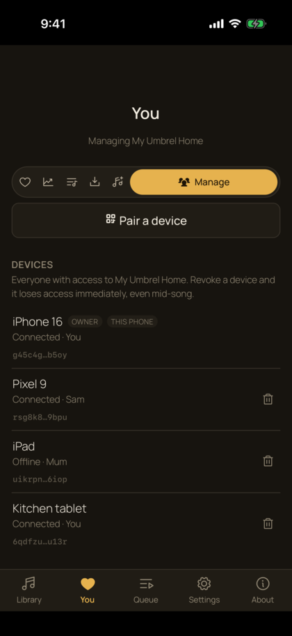

# PearTune

The music on your own server, or a friend's, playable anywhere. No port forwarding, no VPN, no dynamic DNS, no account, no cloud copy of your files.

PearTune is a peer-to-peer music player. The library stays on a machine someone owns - an Umbrel, a NAS, an old desktop - and a phone reaches it directly over an encrypted peer-to-peer connection. Nothing is exposed to the internet, and files are never copied to anyone else's server.

That machine does not have to be yours. A library's owner can let a friend or family member in, each as their own person with their own devices, and cut any of them off again in a second. So PearTune is two things at once: how you reach your own music from anywhere, and how someone shares theirs with you without handing out a login or copying a file.

<table>
<tr>
<td width="50%"></td>
<td width="50%"></td>
</tr>
<tr>
<td><em>Letting someone in: they scan, or you send the link.</em></td>
<td><em>Who has access, and cutting any of them off.</em></td>
</tr>
</table>

## Why

Self-hosted music servers (Navidrome, Jellyfin, Plex) are good at playback. The part people actually struggle with is **remote access**: reverse proxies, port forwarding, VPNs, dynamic DNS, or paying for someone's remote-access tier. PearTune makes that part disappear.

## How it works

Two pieces:

- **The host** runs on the machine with the music. It serves your library and holds the list of devices allowed to reach it.
- **The app** runs on your phone. It pairs with the host by scanning a QR code, once.

Every connection is end-to-end encrypted and mutually authenticated. The host knows exactly which device is calling, because the connection itself proves it. There are no passwords or connection strings to leak.

## Getting the app

**There is no published app yet.** PearTune has not been released to the Play Store, the App Store or Zapstore, and there is no GitHub release to download. The Android and iOS clients are built from this repo; the [Status](#status) section below says exactly where things stand.

When there is something to install, it will be linked here.

## Setting it up

**[Getting started](docs/getting-started.md)** walks the whole thing end to end, with screenshots: install the host, point it at your music, pair a phone, see who has access, and revoke someone.

Install pages for a specific machine: [Linux and Docker](docs/host-linux.md) · [macOS and Windows](docs/host-macos-windows.md).

**On Umbrel**, use the Docker path on the Linux page for now. The PearTune community-store listing is written but not published, so it will not appear in Umbrel's app store yet.

**Start9 is not a supported target right now.** A host works there, but StartOS runs every service behind a container NAT that peer-to-peer connections cannot punch through, so all traffic falls back to a relay - which works, and costs PeerLoom bandwidth for music that often never leaves the listener's home. Measured and tabled on 2026-07-29; see [`start9/README.md`](start9/README.md) for the numbers.

### When the phone can't reach the host directly

Most of the time your phone connects straight to your host. But some mobile carriers and locked-down wifi refuse a direct peer-to-peer connection, and when that happens PearTune can fall back to a relay run by PeerLoom. The relay only forwards traffic that is already encrypted: it can see that your device is talking to your host and how much data moves, but never the contents, and it never keeps a copy of anything. It is on by default and you can turn it off in **Settings > Connection**. Full explanation at [peerloomllc.com/relay](https://peerloomllc.com/relay).

## Library sources

Pick a source in the dashboard - no compose file to edit. Point the host at:

- an existing **Navidrome** (or any Subsonic-API) server, and PearTune uses its library, artwork and transcoding, or
- an existing **Jellyfin** server, likewise, or
- a **plain folder of music files**, and PearTune reads the tags itself - artist, album, track number, year and embedded cover art (ID3, Vorbis, MP4, FLAC), so a folder is a real library, not a list of filenames.

The app cannot tell the difference. Switching sources keeps each one's settings, so you can flip between them freely.

**Plex** is intentionally not supported. Not for legal reasons - Plex publishes an official API and exempts music from its remote-playback paywall - but because a Plex server can only be read through a plex.tv **cloud** account whose token expires every seven days. A daemon that must phone a cloud service every week just to read a disk it is sitting next to is the exact problem PearTune exists to remove. (See `DECISIONS.md`, 2026-07-14.)

## Access control

Grant access per device and per person. Your phone, your tablet, your partner's phone, a friend you lend the library to. Revoke any one of them without disturbing the others, and revocation takes effect immediately - mid-song, if need be.

A pass can also be temporary: a **guest pass** expires on its own after a time you set, and the app shows the guest a countdown. Lending someone the library for a weekend does not depend on you remembering to cut them off.

## In the app

Browse by artist, album, genre or track, with artwork, and search the whole library. Gapless playback, shuffle and repeat, a sleep timer, and audio that keeps going in the background and on the lock screen.

Beyond playing:

- **Playlists** you make on the phone, plus the read-only ones your server already has.
- **Downloads** - pin an album to keep it on the phone, for a flight or a tunnel.
- **Favourites and resume points** that follow you between your own devices, so a track paused on one is where you left it on another. Playback itself hands over rather than doubling up: starting on a second device pauses the first.
- **Requests** - someone you have let in can ask the owner for music they cannot find, and the owner works through the queue in the app.
- **Manage from the phone** - an owner sees every device, pairs a new one and revokes any of them without going to the dashboard.
- **Several libraries at once**, blended into one, if you are let into more than one.

## Status

**Alpha. Working, but not yet publicly released.**

The wire protocol (`proposals/2026-07-13-wire-protocol.md`) is implemented and the whole path runs: scan the QR, browse the library, play. The host is packaged as a Docker image and runs on an Umbrel, and both the Android and the iOS clients run on real phones. Pairing, gapless playback, per-person grants, live revocation and multiple hosts in one merged library have all been exercised on real devices against real hosts, including off-LAN over cellular.

What is missing is distribution: no app in any store, no GitHub release, and the Umbrel community-store listing written but not published. Design decisions and the reasoning behind them are in `DECISIONS.md`.

## Privacy and support

PearTune has no account and no server of ours between you and your music. What the optional relay can and cannot see is spelled out in the [privacy policy](https://peerloomllc.com/peartune/privacy).

Questions, bugs or a host that will not behave: [open an issue](https://github.com/peerloomllc/peartune/issues), or see the [support page](https://peerloomllc.com/peartune/support).

## License

MIT. See `LICENSE`.
