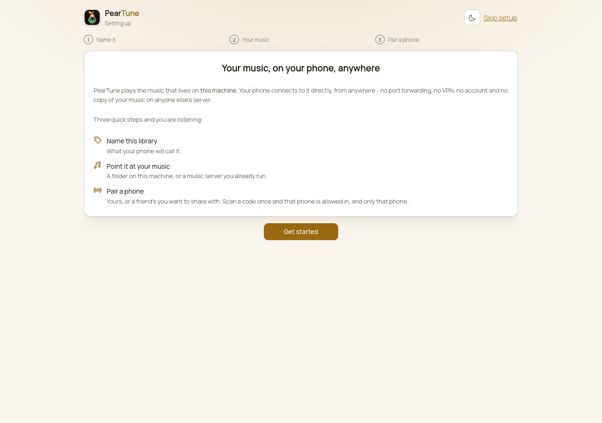
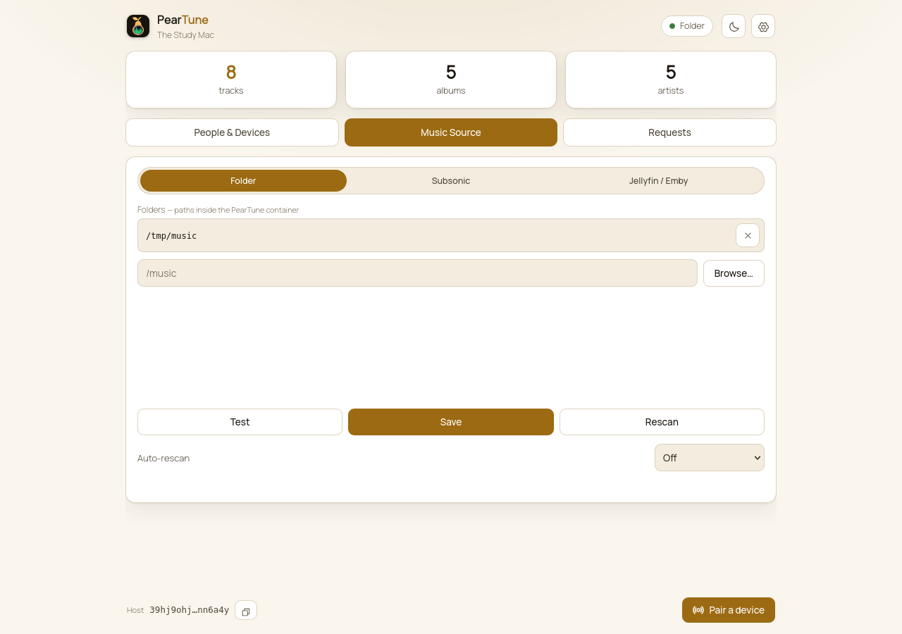
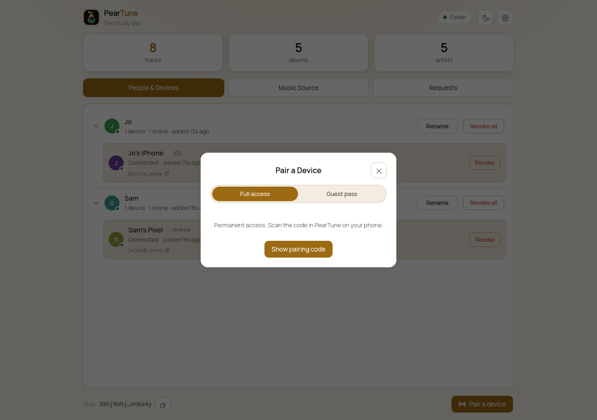
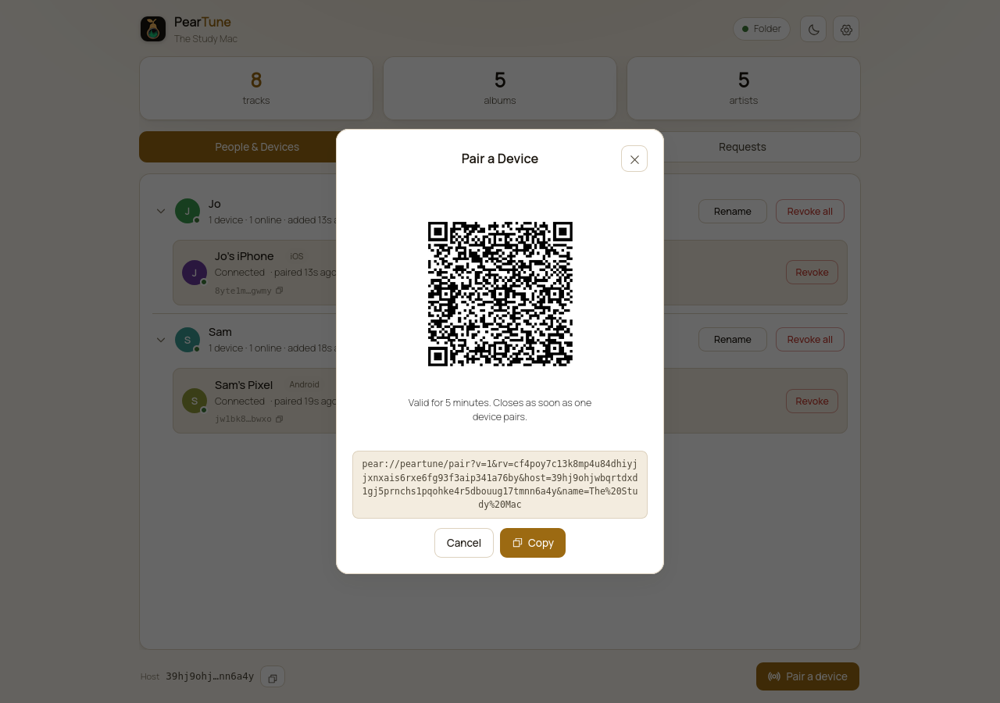
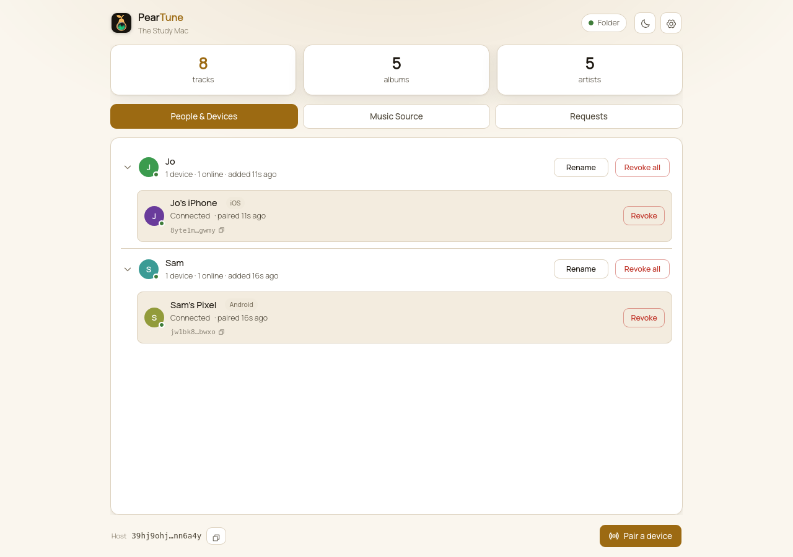

# Getting started with PearTune

**Who this is for:** the person who has the music. You will install PearTune on the
machine your files already live on, then let phones reach it - yours, and anyone else's
you choose.

It takes about ten minutes, and you never touch your router.

> Just want to run the host and skip the explanation? The install commands live in
> [`host-linux.md`](host-linux.md) and [`host-macos-windows.md`](host-macos-windows.md).
> This page is the whole story end to end.

## What you are setting up

Two pieces, and it helps to be clear about which is which.

| | Runs on | Does |
| --- | --- | --- |
| **The host** | The machine with the music - a NAS, an Umbrel, an old desktop, a Mac | Serves your library, and holds the list of devices allowed to reach it |
| **The app** | A phone | Browses and plays |

The host is always on. The app connects to it directly, encrypted end to end, from
anywhere - your sofa, a train, another country. There is no port forwarding, no VPN, no
dynamic DNS, no account, and no copy of your music on anyone else's server.

**The machine does not have to be yours.** If a friend runs a host, they can let you in
as your own person with your own devices, and cut you off again in a second. You never
get a login, and no file is ever copied to you.

---

## Step 1 - install the host

**On a Mac, a Windows PC or a Linux desktop, install the PearTune desktop app.** It is
the host wrapped in a menubar / tray app: it starts at login, has **Open dashboard** and
**Quit**, and needs no terminal and no password. A `.dmg` on macOS, an installer `.exe`
on Windows, an **AppImage** or `.deb` on Linux.

> PearTune has no public release yet, so there is nothing to download today - the
> installers are built from this repo, and they land on the GitHub releases page when the
> first release ships. Build instructions are on the two install pages below.

Running it on a server, a NAS or a headless box instead? Pick your page:

- **Linux, a NAS, or anything with Docker** - [`host-linux.md`](host-linux.md)
- **macOS or Windows** - [`host-macos-windows.md`](host-macos-windows.md)
- **Umbrel** - install PearTune from the app store; there is nothing else to do
- **Start9** - not supported for now. A host runs there, but StartOS's container networking forces every connection through a relay rather than a direct one. See [`../start9/README.md`](../start9/README.md).

Whichever you pick, the host prints something like this when it starts (the desktop app
shows you the dashboard instead of a log):

```
  library    The Study Mac
  source     folder @ /music  (8 tracks)
  host key   i9epe34b...emdh9o
  dashboard  http://127.0.0.1:8741
```

Two things to note now, because they matter later:

- **The dashboard address.** That is the control panel. Everything below happens there.
- **The dashboard password.** If your host is reachable on your network rather than only
  on itself, it needs one. Set `PEARTUNE_PASSWORD`, or leave it alone and the host
  generates a strong one on first run, prints it in the log, and saves it to
  `<data>/dashboard-password`. **The desktop app has no password** - it binds to the
  machine itself, so only someone already sitting at it can open the dashboard. The same
  is true of any host you reach through an SSH tunnel.

---

## Step 2 - open the dashboard

The first time you open it, PearTune walks you through setup rather than dropping you in
at the deep end.



The three steps are exactly the next three sections. You can **Skip setup** and do them
in any order from the tabs - nothing here is one-way.

---

## Step 3 - point it at your music

Open the **Music Source** tab. PearTune reads your library one of three ways, and the app
cannot tell the difference between them.



- **Folder** - point it at a directory of music files. PearTune reads the tags itself:
  artist, album, track number, year and embedded cover art, across ID3, Vorbis, MP4 and
  FLAC. A folder becomes a real library, not a list of filenames.
- **Subsonic** - you already run Navidrome, Gonic, LMS, Ampache, Funkwhale, Koel,
  Nextcloud Music, Supysonic or Airsonic-Advanced. PearTune uses that server's library,
  artwork and transcoding.
- **Jellyfin / Emby** - likewise, for a Jellyfin or Emby server you already run.

Press **Test** before **Save**. Test tells you whether the path or the credentials
actually work, which is a much better place to find out than on your phone later.

Then **Save**, and the track / album / artist counts at the top of the page fill in.

> **In Docker, the path is the path inside the container.** If your compose file mounts
> `/srv/music:/music:ro`, type `/music` here, not `/srv/music`. The placeholder in the
> box is a reminder of exactly this.

**Auto-rescan** decides how often PearTune re-reads the library for new files. Off is
fine if you add music rarely; you can always press **Rescan** by hand.

> **Switching source type later loses listening state.** A track's identity includes
> which kind of source it came from, so moving from Folder to Subsonic makes every track
> a *new* track. Favourites and resume points do not carry across. The dashboard warns
> you before you do it.

---

## Step 4 - pair a phone

Install PearTune on the phone, then press **Pair a device** at the bottom right of the
dashboard.



Choose what kind of access this is:

- **Full access** - permanent. Your own phone, your partner's, anyone you actually trust
  with the library.
- **Guest pass** - expires on its own after a time you set. The app shows the guest a
  countdown. Good for lending a friend the library for a weekend without having to
  remember to cut them off.

Then **Show pairing code**.



Scan the code in the app and you are done. If the person is not in the room, use
**Copy** and send them the link instead - it works the same way.

Two properties of that window worth knowing, because they are what make it safe to put a
QR code on a screen:

- **It lasts five minutes.**
- **It closes the instant one device pairs.** It is not a password that keeps working. If
  the wrong device somehow got there first, it takes the slot, you see it in the list, and
  you revoke it.

There is nothing to type on the phone. No password, no server address, no account. The
connection itself proves which device is calling, so there is no token to leak, copy or
forget to rotate.

---

## Step 5 - see who has access

The **People & Devices** tab is the point of the whole thing.



PearTune tracks **people**, not just devices. Each person holds their own devices, and
you can see at a glance who is connected right now. Tap a person to expand them.

- **Revoke** on a device removes that one device and leaves the person's others alone.
- **Revoke all** on a person removes every device they hold, in one action.
- **Rename** fixes a name. A device may name *itself*, but only you decide which person
  it belongs to - a device cannot promote itself into someone else's account.

### Revocation is immediate

This is the part that is genuinely different from handing someone a login, so it is worth
stating plainly.

When you revoke, the host **destroys the live connection**, it does not merely stop
future ones. Within about a second, that phone can no longer browse, load artwork, fetch
the next track or reconnect. Everything new is denied.

The one deliberate exception: whatever the phone had already buffered may finish playing.
That is on purpose - it is the same mechanism that keeps your own music playing when you
walk out of wifi range onto mobile data. What revocation guarantees is that nothing
**new** gets through.

---

## Step 6 - check it actually works

Worth doing once, properly, so you know it works before you need it to.

1. On the same wifi as the host: browse, play a track, seek within it.
2. **Turn wifi off on the phone and use mobile data.** Play something. This is the real
   test - it is the whole "no port forwarding" claim, and it is the step people skip.
3. Revoke that phone from the dashboard mid-song. Its next track, browse and artwork
   should all fail within a second.
4. Pair it again. Takes one scan.

If step 2 fails but step 1 works, your network is refusing direct peer-to-peer
connections. PearTune falls back to a relay in that case - see **Settings > Connection**
in the app, and [the relay explainer](https://peerloomllc.com/relay).

---

## Where things are kept

Worth knowing before you move machines or set up backups.

- **The data directory** (`/data` in Docker, `PEARTUNE_DATA` otherwise) holds the host's
  identity and the list of who has access. **Back this up.** To move your library to a
  different machine, move this directory and point the new host at the same music - every
  phone that was already paired keeps working, with nothing to re-pair.
- **Your music is never modified.** The music mount is read-only in every install path.
- **The access list never leaves the host.** It is deliberately not synced or shared
  anywhere, so a revoked device has no route to write itself back in. Your host is the
  only authority on who gets in.

## If something is wrong

- **The app cannot find the host at all.** Check the host is actually running and its log
  shows a `host key`. On Docker, check you used `network_mode: host` - Docker's default
  bridge network adds a second layer of NAT that stops the connection working.
- **The library is empty after Save.** Press **Test** on the Music Source tab; it reports
  the real error. In Docker this is almost always a path inside vs outside the container.
- **A pairing code says it expired.** They last five minutes and are single-use. Open a
  new one.
- **Music stops when you leave the house.** That is the relay case in step 6 above.
